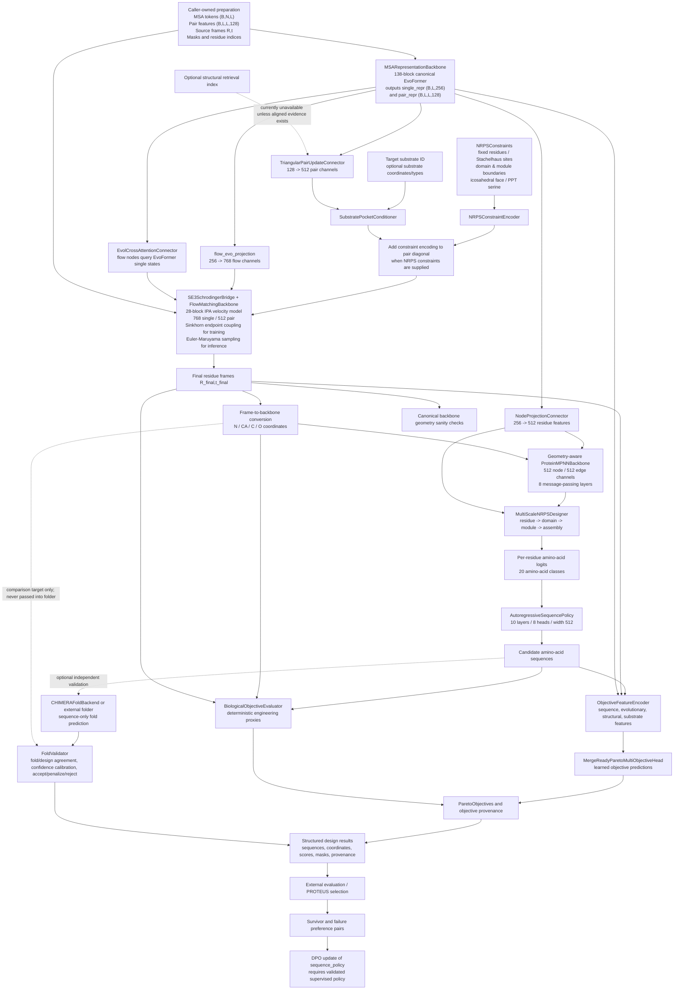

# CHIMERA Full Architectural Diagram and Blueprint

**Repository:** `Izik-us/psc-chimera`  
**Branch:** `chimera-repair`  
**Architecture entry point:** `chimera.architecture.CHIMERAv2` / `CanonicalCHIMERAv2`  
**Scope:** full model composition, internal dataflow, training, inference, folding validation, datasets, checkpoints, supporting modules, legacy boundaries, and current readiness limits.

This document is a source-level blueprint, not a claim of biological validation. The canonical model is randomly initialized unless weights are explicitly loaded. A module's existence, a passing software test, a finite loss, or a successful optimizer update does not establish that it has learned useful protein-design behavior.

---

## 1. Architecture identity and non-negotiable boundaries

CHIMERA is a research-stage computational design system intended to propose NRPS-related protein sequences and backbone structures while accounting for evolutionary context, residue geometry, substrate conditioning, domain/module organization, objective trade-offs, and downstream experimental feedback.

The public canonical composition is assembled in `chimera/architecture.py`. The `CanonicalCHIMERAv2` constructor explicitly creates the model components. The top-level package exports `CHIMERAv2` through `chimera/__init__.py`, which resolves to the canonical architecture rather than the legacy composition.

The current canonical constructor defaults are:

| Setting | Default |
|---|---:|
| Evolutionary single representation | 256 channels |
| Evolutionary pair representation | 128 channels |
| SE(3) flow single width | 768 |
| Conditioned pair width | 512 |
| Geometric sequence-designer width | 512 |
| EvoFormer blocks | 138 |
| SE(3) flow blocks | 28 |
| Nominal flow sampling steps | 20 |
| Flow attention heads | 12 when single width is 768 |
| Pair-connector heads | 4 |
| Evolutionary cross-attention heads | 8 |
| ProteinMPNN-inspired message-passing layers | 8 |
| Geometric graph neighbors | 32 |
| Domain count in hierarchy | 5 |
| Module count in hierarchy | 5 |
| Autoregressive policy layers | 10 |
| Autoregressive policy heads | 8 |
| Retrieval neighbors | 5 |
| Monte Carlo uncertainty samples | 30 |
| Default sequence draws in direct model forward | 10 |

**Depth clarification:** `CanonicalCHIMERAv2.__init__` defaults `evoformer_n_blocks=138` and passes that value into `MSARepresentationBackbone`. The reusable `MSARepresentationBackbone` can have its own smaller default, but that does not override the canonical composition's explicit 138-block argument. Small configurations in tests are not the canonical default. Any documentation saying that the canonical model defaults to 48 blocks is stale relative to this constructor.

**External-model boundary:** the canonical EvoFormer is a CHIMERA-owned implementation of the EvoFormer information-flow pattern, not a trained AlphaFold/OpenFold model. The SE(3) generator is CHIMERA's local Schrödinger-bridge/velocity architecture, not native RFdiffusion. The geometric sequence recovery model is ProteinMPNN-inspired, not native ProteinMPNN. Optional native adapters and external command-line folders are separate components, not silently substituted into the canonical model.

**Input boundary:** canonical structure generation consumes caller-prepared MSA tokens, pair features, source backbone rotations/translations, and optional NRPS constraints and substrate data. CHIMERA does not automatically create all of those inputs from a raw sequence. Input preprocessing, mapping, masking, and preprocessing identity must be supplied and tracked by the calling pipeline.

**Readiness boundary:** source code, tests, weights, training provenance, objective calibration, scientific validation, and biological validation are different claims. The canonical composition is research-only unless the required component and objective statuses carry validated training/validation provenance and calibration evidence.

---

## 2. Complete end-to-end architecture diagram

The following diagram shows the full canonical design path, including independent conditioning branches and the downstream experimental-feedback loop.

This is a dependency graph, not a promise that every branch is trained or available. Retrieval is currently reported as unavailable without aligned query/index evidence. Neural objective predictors are not validated by default. CHIMERAFold is an independent, untrained-by-default auxiliary folder and is not part of the 767.74M-parameter canonical design model.

---

## 3. Inputs and tensor contracts

### 3.1 MSA tokens

The canonical forward call receives `msa_tokens` with shape `(B,N,L)`:

- `B`: batch size.
- `N`: number of aligned MSA sequences.
- `L`: residue length.

Tokenization and MSA construction are upstream responsibilities. Padding masks identify invalid MSA positions. The EvoFormer uses explicit MSA and residue masks, and may receive a `residue_index` tensor to preserve nonconsecutive numbering or gaps. The first/query row represents the target sequence; the final single representation is projected from that query row, not an average of all MSA rows.

### 3.2 Initial pair features

The caller provides `initial_pair_features` with shape `(B,L,L,128)` in the canonical default. The model validates the exact expected dimensions. These features seed the pair representation and are refined by the EvoFormer and then the triangular pair connector. They are not synthesized automatically from raw sequences by the public inference API.

### 3.3 Source backbone frames

The caller provides:

- `source_R`: `(B,L,3,3)` rotation matrices.
- `source_t`: `(B,L,3)` translations / C-alpha frame positions.

These define the source structure from which the SE(3) generator transports the backbone. They must be on the same device as the MSA and pair features.

### 3.4 Optional conditioning inputs

The forward API can also receive:

- MSA padding mask.
- Residue mask and residue indices.
- `NRPSConstraints`, including fixed residue/sequence constraints, Stachelhaus positions, domain boundaries, module boundaries, icosahedral face, PPT serine position, and optional domain type identifiers.
- Substrate token/ID.
- Substrate coordinates and substrate atom/type features.
- Number of flow steps and number of sequence draws.
- Sequence sampling temperature and an explicit random generator.
- Geometry validation selection.

Constraints are normalized against batch and sequence dimensions and validated against the assembly schema. Inactive module spans may use the explicit `(0,0)` sentinel; active spans must be non-empty and inside sequence length. The model rejects invalid domain types, invalid face identifiers, impossible boundaries, incompatible tensor dimensions, and unsupported length requests rather than silently accepting them.

---

## 4. Evolutionary representation: canonical EvoFormer

**Source:** `chimera/components.py`, `chimera/evoformer_stack.py`, `chimera/evoformer.py`  
**Composition:** `CanonicalCHIMERAv2.evoformer`  
**Default dimensions:** `C_m=256`, `C_z=128`, `C_s=256`  
**Canonical depth:** 138 blocks.

The EvoFormer exchanges information between aligned sequence observations and residue-pair features. Its job is to encode evolutionary and pairwise constraints before the structure generator moves residue frames.

### 4.1 Initial representations

The MSA token embedding creates the MSA representation:

`M ∈ R^(B × N × L × C_m)`

Caller pair features seed the pair representation, with learned signed relative-position information added:

`Z ∈ R^(B × L × L × C_z)`

Relative positions are clipped to the configured range (default ±32). A caller-supplied `residue_index` supports discontinuous or nonconsecutive residue indexing. Pair masks are built from valid residue masks.

### 4.2 Every EvoFormer block, in execution order

1. **MSA row attention with pair bias.** Attention operates along residue positions independently for each MSA row. The pair representation generates a per-head attention bias. Gating and explicit validity masks are applied.
2. **MSA column attention.** Attention mixes information across aligned sequences at each residue position, respecting the MSA padding mask.
3. **MSA transition.** Layer normalization, expansion to four times the MSA width, ReLU, and projection back to the MSA width.
4. **Masked Outer Product Mean (OPM).** Two learned MSA projections form pairwise outer products. The reduction accounts for sequences valid at both residues, uses the configured epsilon (default `1e-3`), projects into pair channels, and supports chunking.
5. **Outgoing triangle multiplication.** Pair states aggregate triangle-compatible information in the outgoing orientation.
6. **Incoming triangle multiplication.** Pair states aggregate triangle-compatible information in the incoming orientation.
7. **Starting-node triangle attention.** Pair attention propagates information using the starting-node orientation.
8. **Ending-node triangle attention.** Pair attention propagates information using the ending-node orientation.
9. **Pair transition.** Layer normalization, fourfold expansion, ReLU, and projection back to pair width.

Residual updates, masks, dropout, and optional attention/OPM chunking are handled by the canonical stack. Fully masked rows must remain finite. Invalid pair states are zeroed after relevant updates to prevent padded positions from leaking into valid representations.

### 4.3 Outputs

The compatibility forward path returns:

- `single_repr`: `(B,L,256)`, projected from the first/query MSA row.
- `pair_repr`: `(B,L,L,128)`, refined pair states.

The richer representation interface can expose MSA, pair, single states, and diagnostics. The evolutionary model is not pretrained by default. Its architecture resembles the EvoFormer core but does not include the complete AlphaFold input pipeline, template/Extra-MSA stacks, recycling schedule, AlphaFold structure module, all auxiliary heads, or AlphaFold trained parameters.

---

## 5. Pair representation and triangular conditioning connector

**Source:** `chimera/components.py`  
**Class:** `TriangularPairUpdateConnector`  
**Input width:** 128  
**Output width:** 512  
**Heads:** 4  
**Observed source-level parameter count:** 9,005,056.

The connector maps the EvoFormer pair representation into the width expected by the SE(3) flow. It refines pair features with triangular pair updates/attention and provides the structural generator with a conditioned pair tensor:

`pair_repr (B,L,L,128) -> pair_cond (B,L,L,512)`

It can accept retrieved context through its interface, but the canonical path does not claim retrieval is operational merely because the connector supports a context argument. The current forward path reports retrieval as unavailable when an aligned query/index embedding space is not configured.

Substrate conditioning is applied downstream to the conditioned pair tensor. NRPS constraints are encoded and added at residue-pair diagonal positions in the canonical forward path, so constraints can influence residue-local structure generation without changing the caller's raw pair-feature contract.

---

## 6. Evolutionary single-state projections and cross-attention

### 6.1 Flow single projection

**Attribute:** `flow_evo_projection`  
**Projection:** 256 -> 768  
**Observed parameter count:** 197,376.

This linear projection converts EvoFormer single states to the SE(3) flow's wider node representation. It is explicit in the forward path and avoids passing a 256-wide tensor to a 768-wide flow network.

### 6.2 Evolutionary cross-attention connector

**Attribute:** `evol_cross_attn`  
**Query width:** 768  
**Memory width:** 256  
**Heads:** 8  
**Observed parameter count:** 4,386,944.

The flow network can call this connector during integration. Current flow nodes query the EvoFormer single-state memory, with time conditioning, to provide noise/time-adaptive evolutionary guidance while generating structure. This connector is separate from the pair-conditioned IPA path.

### 6.3 Residue node projection

**Attribute:** `node_connector`  
**Projection:** 256 -> 512  
**Observed parameter count:** 1,117,952.

This connector maps evolutionary residue features into the geometric sequence-design width. It is a conditioning path for sequence recovery, separate from the 256 -> 768 flow projection.

---

## 7. SE(3) backbone generation and Schrödinger bridge

**Sources:** `chimera/se3_flow.py`, `chimera/schrodinger_bridge.py`, `chimera/lie.py`, `chimera/geometry.py`  
**Core classes:** `FlowMatchingBackbone`, `VelocityField`, `InvariantPointAttention`, `SchrodingerBridge`, `SE3SchrodingerBridge`  
**Defaults:** single width 768, pair width 512, 28 IPA blocks, 12 heads, 4 query/key points per head, 8 value points per head, diffusion 0.05, 50 Sinkhorn iterations, 20 nominal inference steps.  
**Observed parameter count of `flow_model`:** 350,910,246.

### 7.1 Velocity network

The velocity field predicts rotational and translational motion conditioned on the current structure state, pair features, time, source structure, evolutionary state, and optional substrate coordinates. The core IPA attention combines:

- Scalar query/key/value attention.
- Query/key/value points transformed into residue frames and then global coordinates.
- Pair-feature bias.
- Learnable weighting of point-distance attention versus scalar attention.
- Optional substrate-proximity bias.
- Output projection from concatenated scalar, point, and pair context.

A time embedding is projected through a learned MLP. A backbone-state encoder converts the current rotation/translation state into node features. The network's output represents angular velocity in a local Lie-algebra coordinate chart and Euclidean translation velocity.

### 7.2 Bridge endpoint coupling

The Schrödinger-bridge utility computes a pairwise endpoint cost from rotational and translational coordinates. Entropic optimal transport is approximated using log-domain Sinkhorn scaling with configured regularization and iteration count. The coupling defines which source/target endpoints are paired during bridge training.

### 7.3 Bridge training target

For Euclidean translation coordinates, the implementation uses the Brownian bridge conditional

`x_t = (1-t)x_0 + t x_1 + sqrt(2 D t(1-t)) ε`

and conditional drift

`b*(x,t|x_1) = (x_1-x)/(1-t)`.

The loss regresses predicted drift against the bridge target, with valid-mask normalization where supplied. Rotation is represented in a local Lie-algebra chart using SO(3) logarithm/exponential operations. This is explicitly a local approximation, not an exact closed-form heat-kernel Schrödinger bridge on SO(3).

### 7.4 Sampling

Inference initializes from the supplied source frames and integrates the stochastic bridge-conditioned field using Euler-Maruyama. The local model is not native RFdiffusion and does not become RFdiffusion merely because RFdiffusion-style backbone design is a scientific motivation. An external RFdiffusion checkpoint must pass the model's strict compatibility requirements before it can be considered usable; a native upstream checkpoint is not automatically a compatible local state dict.

### 7.5 Frame-to-coordinate conversion and geometry

Final rotations and translations are converted to backbone coordinates for N, CA, C, and O. The local geometry validator checks backbone sanity, but these checks are not force-field energy calculations, foldability predictions, experimental measurements, or proof of biological function.

---

## 8. NRPS constraints and substrate conditioning

### 8.1 Constraint schema

**Sources:** `chimera/domain_schema.py`, `chimera/components.py`  
**Classes:** `NRPSConstraints`, `DomainSpan`, `DomainType`, `AssemblySchema`, `NRPSConstraintEncoder`  
**Constraint encoder width:** 512  
**Observed parameter count:** 1,027,584.

The constraint schema supports fixed positions or sequence identities, Stachelhaus positions, domain boundaries, module boundaries, domain types, an icosahedral face identifier, and a PPT serine position. The encoder maps those structured declarations into conditioning features. The canonical forward path validates spans and type IDs before using them.

Fixed-sequence positions are applied to amino-acid logits so disallowed residues at those positions receive a large negative logit and the requested fixed residue remains available. Fixed backbone positions are passed to the structural sampler through its fixed mask when the relevant constraint is present.

### 8.2 Substrate pocket conditioner

**Source:** `chimera/conditioning.py`  
**Attribute:** `substrate_conditioner`  
**Pair width:** 512  
**Observed parameter count:** 747,648.

The conditioner receives substrate identity and may receive substrate coordinates/types plus residue coordinates. It modifies pair conditioning to introduce substrate-related information into the structural generation path. It is not evidence that a generated pocket binds the declared substrate; selectivity remains a learned/proxy objective until supported by appropriate labels and experiments.

### 8.3 Icosahedral assembly constraints

The domain schema carries a face identifier for assembly-related conditioning. A deterministic assembly-compatibility evaluator also exists. The presence of this branch does not constitute proof that a generated sequence assembles into a functional particle. It is a geometric compatibility proxy and must be evaluated independently.

---

## 9. Geometry-aware ProteinMPNN-inspired base

**Sources:** `chimera/components.py`, `chimera/proteinmpnn.py`  
**Attribute:** `base_mpnn`  
**Node width:** 512  
**Edge width:** 512  
**Message-passing layers:** 8  
**Maximum neighbors:** 32  
**Geometric edge feature width:** 28  
**Observed parameter count:** 57,257,996.

The base sequence-recovery module receives generated backbone coordinates and evolutionary residue features. It constructs a residue graph from geometric positions/frames, uses up to 32 neighbors, and carries a 28-dimensional geometric edge descriptor. It derives local, rigid-transform-invariant node descriptors and edge geometry from the backbone. Invalid residues and invalid edges are masked; the graph path is designed to be insensitive to a shared rigid rotation/translation of the input structure.

This is a CHIMERA-local ProteinMPNN-inspired implementation. The separately available native ProteinMPNN adapter is not called automatically by the canonical composition. Passing tests for shape, masks, or rigid-transform invariance establishes software contracts, not equivalence to native ProteinMPNN or learned sequence recovery quality.

---

## 10. Multi-scale hierarchical NRPS sequence designer

**Source:** `chimera/sequence_design.py`  
**Attribute:** `multi_scale_designer`  
**Widths:** residue 512, domain 1024, module 2048, assembly 1024  
**Domain count:** 5  
**Module count:** 5  
**Edge width:** 28  
**Observed parameter count:** 54,372,887.

The designer combines residue-level geometry and evolutionary features with hierarchical domain, module, and assembly representations. The scales are separate learned computations; the architecture is intended to make local residue plausibility and larger interface compatibility visible to the same sequence-design process.

### 10.1 Residue scale

Consumes residue/node features and the local residue graph. It emits per-residue amino-acid logits over 20 standard amino-acid classes. Edge masks and domain/module assignments constrain message passing and aggregation.

### 10.2 Domain scale

Aggregates residue features within declared domain spans and applies domain-level attention at width 1024. Domain type information distinguishes A, T/PCP, C, TE, linker, or other schema-supported domain roles as configured.

### 10.3 Module scale

Combines domain features into module representations at width 2048 and models inter-domain/module interface compatibility. The architecture exposes this as a separate learned hierarchy, not merely a renamed residue layer.

### 10.4 Assembly scale

Combines module/interface information at width 1024 with the assembly-face representation and constraints. It is intended to condition designs on higher-order compatibility, but is not a physical simulation of capsid assembly.

### 10.5 Output

The designer emits logits with shape `(B,L,20)` per draw. The canonical forward path can sample multiple draws from the same backbone; the separate inference runtime uses one sequence draw per candidate microbatch. The number of sequence draws changes sampling work, not the number of architecture parameters.

---

## 11. Autoregressive sequence policy

**Source:** `chimera/autoregressive_policy.py`  
**Attribute:** `sequence_policy`  
**Width:** 512  
**Layers:** 10  
**Heads:** 8  
**Feed-forward width:** 2048 in the configured policy  
**Observed parameter count:** 31,807,508.

The policy conditions on a residue context derived from the design model and autoregressively predicts amino-acid tokens. It supports teacher-forced token loss for supervised training, log-probability scoring, and autoregressive sampling at inference. Fixed tokens can be enforced during generation.

The model exposes `sequence_policy_loss` as a teacher-forced loss path. It accepts target token sequences and a padding mask, validates the vocabulary range, ignores padding, and returns a finite scalar cross-entropy objective when valid targets are present.

The policy is the parameterized component updated by DPO after an initial supervised policy has been trained and validated. Preference training is rejected unless the reference policy can be initialized from a validated policy. The presence of a DPO trainer is not evidence that a PROTEUS campaign or preference update has already happened.

---

## 12. Objective feature encoder and learned Pareto head

**Sources:** `chimera/pareto_pcgrad.py`, `chimera/objective_schema.py`  
**Attributes:** `objective_feature_encoder`, `pareto_head`  
**Observed parameter counts:** objective feature encoder 183,485; Pareto head 2,889,732.

The objective feature encoder maps named input sources into the shared model width. The current source plan includes:

- Sequence features: one-hot amino-acid features of width 20.
- Evolutionary features: EvoFormer single states of width 256.
- Structural features: 52 dimensions assembled from structural invariants and a 20-way assembly-face feature.
- Substrate features: one-hot substrate identity of width 20 when supplied.

The exact set of available objective predictions is selected from the configured feature-source plan. An objective is only considered available when all required feature sources are present. The Pareto head predicts objective channels from the encoded representation.

The canonical objective channels include evolutionary plausibility, structural stability, expression efficiency, substrate selectivity, and assembly compatibility. Their names do not mean they are all empirically validated. The first four neural channels are learned surrogates and remain random/unvalidated until trained on appropriate labels and validated; assembly compatibility is computed deterministically in the evaluator. Proxy scores are engineering signals, not direct biological measurements.

Objective target validation, source provenance, label kind, calibration evidence, and held-out dataset identity are tracked. Calibration requires a distinct held-out calibration manifest and enough examples; it cannot reuse training or validation manifests.

---

## 13. Deterministic objective evaluator

**Source:** `chimera/evaluators.py`  
**Attribute:** `objective_evaluator`  
**Parameterized model count:** no learned parameters in the canonical evaluator.

The deterministic evaluator scores engineering properties from candidate sequences, coordinates, rotations, and assembly-face identifiers. It provides explicit proxy outputs such as structural validity, expression-efficiency proxy, evolutionary plausibility proxy, substrate/selectivity proxy, and deterministic assembly compatibility, depending on the inputs and evaluator contracts.

The distinction between the deterministic evaluator and the learned Pareto head is deliberate:

- The deterministic evaluator computes its declared proxy directly.
- The neural head predicts learned objectives from feature embeddings.
- The Pareto result combines predictions and evaluator values while recording which objectives were actually available.
- Neither path should be described as experimental validation without independent measurements.

---

## 14. Pareto selection, Bayesian uncertainty, and retrieval

### 14.1 Pareto objectives

**Source:** `chimera/pareto_pcgrad.py`.

The Pareto representation records the five named objective channels and their availability. Pareto ranking concerns trade-offs among the available objectives; it does not turn uncalibrated scores into reliable probabilities or guarantee biological optimality.

### 14.2 Bayesian uncertainty estimator

**Source:** `chimera/bayesian.py`  
**Default Monte Carlo samples:** 30.

The uncertainty estimator is part of the model composition and can provide uncertainty estimates for supported predictors. Its output is only decision-useful when the predictor is trained and calibration evidence exists. Uncertainty sampling from random parameters is not validated epistemic uncertainty.

### 14.3 Expected improvement

The repository contains probabilistic optimization utilities for expected improvement and candidate selection. These are research utilities. Their use depends on objective readiness, an explicit utility/objective selection, and sufficient evidence. They are not automatically a production optimizer merely because their code is present.

### 14.4 Structural retrieval

**Source:** `chimera/retrieval.py`  
**Attribute:** `structural_retriever`  
**Default neighbors:** 5  
**Observed parameter count:** 1,190,080.

The retriever supports building an embedding index and returning context. In the current canonical inference path, retrieval is not operational unless query and index embedding spaces are aligned. If retrieval is requested without aligned evidence, the model reports `RAG_UNAVAILABLE`; it does not silently fabricate retrieved context. `ret_proj` (30 -> 512, 15,872 parameters) is a separate projection path, not proof of a usable retrieval corpus.

---

## 15. Full-size source-level parameter audit

The audit script is `scripts/audit_full_size_model.py`. It constructs the actual `CanonicalCHIMERAv2()` with the constructor's default dimensions and counts all unique registered model parameters. It also reports each top-level component and runs a bounded teacher-forced sequence-policy optimizer smoke step on the full-size model instance.

The first independent GitHub Actions audit produced the following source-level count before it stopped on a comparison against the old planning estimate:

| Top-level component | Observed parameters |
|---|---:|
| `evoformer` | 252,619,415 |
| `flow_evo_projection` | 197,376 |
| `flow_model` | 350,910,246 |
| `base_mpnn` | 57,257,996 |
| `pair_connector` | 9,005,056 |
| `evol_cross_attn` | 4,386,944 |
| `node_connector` | 1,117,952 |
| `constraint_encoder` | 1,027,584 |
| `structural_retriever` | 1,190,080 |
| `substrate_conditioner` | 747,648 |
| `multi_scale_designer` | 54,372,887 |
| `objective_feature_encoder` | 183,485 |
| `pareto_head` | 2,889,732 |
| `_seq_to_repr` | 10,752 |
| `sequence_policy` | 31,807,508 |
| `ret_proj` | 15,872 |
| **Total** | **767,740,533** |

Raw FP32 parameter storage is about 2.86 GiB. This excludes gradients, optimizer state, activation tensors, temporary workspaces, data, and the Python runtime.

The earlier 749,197,845 value was a planning estimate, not the actual instantiated count. The authoritative count for this source revision is 767,740,533. The audited default is therefore a roughly 768M-parameter architecture, not exactly 750M. The count does not include the separate CHIMERAFold model, optional external ESM/ProteinMPNN models, external folding backends, or the standalone CodonOptimizer.

The audit's training update is a **synthetic one-step `CanonicalTrainer` SEQUENCE-regime smoke test**. It instantiates the full 767,740,533-parameter model, selects the sequence-stage components (approximately 397,186,510 trainable parameters), executes the staged sequence loss through the EvoFormer, node connector, geometric base, multi-scale designer, sequence projection, and autoregressive policy, and checks the trainer's finite-loss/gradient contract plus a real optimizer update. This audit step completed successfully in [GitHub Actions run 37943814258](https://github.com/Izik-us/psc-chimera/actions/runs/37943814258). The batch is synthetic and only five residues long. This confirms that the full-size model's canonical staged sequence-training path executes, not that the model has completed a meaningful multi-epoch run on biological data, produced a trained full-system checkpoint, or demonstrated scientific performance. The same audit then runs the full canonical forward/generation path on a synthetic two-row, five-residue MSA, with two flow integration steps and one candidate. It verifies output sequence shape `(1, 1, 5)`, backbone coordinate shape `(1, 5, 4, 3)`, and finite coordinates. The combined full-size parameter, training, and inference smoke step passed in [GitHub Actions run 37944021841](https://github.com/Izik-us/psc-chimera/actions/runs/37944021841). This confirms code-path execution only; outputs from randomly initialized weights are not useful design evidence.

---

## 16. Canonical staged training

**Source:** `chimera/training.py`  
**Trainer:** `CanonicalTrainer`  
**Batch contract:** `CanonicalTrainingBatch`.

Training is staged. The architecture remains instantiated as one canonical model, but each regime selects which components are trainable. Freezing changes gradient flow and optimizer scope, not the architecture's registered parameter count.

### 16.1 Representation regime

Trainable module: `evoformer`.

Purpose: fit the evolutionary representation from prepared MSA and pair data. It does not automatically train the flow, sequence designer, objective heads, or DPO policy.

### 16.2 Flow regime

Selected components: EvoFormer, flow single projection, pair connector, flow model, evolutionary cross-attention, constraint encoder, and substrate conditioner.

Purpose: train the bridge/velocity path and its conditioning interfaces. A valid training batch must include source and target frames/coordinates as required by the trainer's loss path. The model's bridge training target and endpoint coupling are not replaced by inference-time sampling.

### 16.3 Sequence regime

Selected components: EvoFormer, node connector, ProteinMPNN-inspired base, multi-scale designer, sequence-to-representation projection, and autoregressive sequence policy.

Purpose: supervise sequence recovery against target amino-acid sequences using the canonical sequence objective. A teacher-forced policy loss can be used directly, but meaningful training requires a provenance-tracked training dataset and held-out validation.

### 16.4 Constraint regime

Selected components: EvoFormer, pair connector, flow model, evolutionary cross-attention, constraint encoder, and substrate conditioner.

Purpose: train the structure-generation path under NRPS and substrate constraints. The gradient contract distinguishes this regime from ordinary flow training; not every connector is expected to receive a gradient in every regime.

### 16.5 Objective regime

Selected components: objective feature encoder and Pareto head.

Purpose: fit objective predictors against explicit labels. Labels carry source and kind metadata, distinguishing proxy labels, surrogate labels, validated-surrogate labels, deterministic evaluator values, and experimental measurements. Calibration is a separate held-out operation, not a side effect of minimizing training loss.

### 16.6 Preference regime

Selected component: `sequence_policy`.

Purpose: use survivor/failure preference pairs from an external evaluation campaign. DPO requires a validated supervised sequence policy and a frozen reference policy. The DPO reference cannot be safely created from an unvalidated random policy.

### 16.7 Optimizer, gradients, validation, and checkpoints

The trainer configures trainable components explicitly, clears gradients outside the selected stage, audits observed gradient flow, checks finite scalar losses, clips gradients where configured, updates optimizer/scheduler state, and tracks global step/epoch.

Validation records the dataset manifest, example count, batch count, loss, objective losses, and source composition. A component is marked validated only when it has training steps and enough held-out examples under the configured validation contract. Objective calibration requires a separate calibration manifest and held-out prediction/uncertainty/target arrays.

Canonical checkpoints include model state and optimizer state plus a manifest binding architecture/configuration hash, state schema, objective schema, dataset identity/version/hash, preprocessing hash, source commit/worktree identity, runtime environment, Python/PyTorch/CUDA metadata, determinism settings, training regime, seed, optimizer and scheduler identity. Checkpoint loading validates compatibility and uses strict state loading. Component transfer checkpoints are marked unverified unless their training and validation provenance is actually established.

---

## 17. Inference runtime and candidate contract

**Sources:** `chimera/inference.py`, `chimera/configuration.py`, `chimera/architecture.py`.

The canonical runtime is `run_inference(model, InferenceRequest(...))`. It requires a `CanonicalCHIMERAv2` instance and a validated configuration. It accepts caller-prepared tensors and optional conditioning, checks input shapes/devices, resolves the configured device, sets the currently verified compute dtype to float32, and applies/restores deterministic runtime policy around the request.

### 17.1 Runtime checks

- The model must be canonical.
- Input tensors must have compatible batch, length, width, and device.
- The requested device must exist; CUDA requests fail if CUDA is unavailable.
- The supported padding policy is `longest_in_batch`.
- Worker counts and hard memory limits are rejected because the synchronous runtime cannot enforce them.
- Checkpoint paths must exist; supplied SHA identities are checked when represented as a digest.
- Unified checkpoints must pass manifest, configuration, state-schema, and objective-schema compatibility checks before strict weight loading.
- A missing checkpoint is reported as unresolved, not assigned a fake identity.
- Untrained or partially trained models are exploratory and are not production-valid.
- Timeouts are cooperative between microbatches and cannot interrupt an active kernel.

### 17.2 Inference execution

For each candidate microbatch:

1. Place the canonical model and caller tensors on the requested device.
2. Set evaluation mode and enter inference mode.
3. Run EvoFormer to obtain single and pair representations.
4. Condition the pair representation on substrate/NRPS constraints.
5. Sample final SE(3) frames with the configured flow-step count.
6. Convert frames to backbone coordinates.
7. Validate geometry when requested.
8. Build geometric residue graph features.
9. Generate per-residue sequence logits using the local geometric sequence machinery.
10. Autoregressively sample the requested amino-acid sequence.
11. Build objective feature embeddings and learned objective predictions where inputs are available.
12. Compute deterministic proxy outputs.
13. Construct candidate records with sequence, token tensor, coordinates, stable candidate digest, geometry status, objective values, and provenance.

### 17.3 Result interpretation

A geometry result is a geometry sanity check. Objective proxy values are not experimental labels. The warning/provenance surface explicitly identifies untrained components, unresolved checkpoint identity, unavailable retrieval, and the approximate status of local EvoFormer/ProteinMPNN-inspired components. The runtime does not invoke native RFdiffusion, OpenFold, ESMFold, or native ProteinMPNN automatically.

---

## 18. CHIMERAFold: separate sequence-to-structure predictor

**Sources:** `chimera/folding/model.py`, `chimera/folding/heads.py`, `chimera/folding/losses.py`, `chimera/folding/frames.py`, `chimera/folding/types.py`.

CHIMERAFold is an auxiliary folding architecture, not a stage inside the canonical 767.74M design generator. Its intended job is to predict a structure from an amino-acid sequence independently of the design backbone, then allow a validator to compare the predicted fold with the intended design.

### 18.1 Why this subsystem exists

The canonical generator can generate a geometrically plausible backbone and then assign a sequence to that backbone. A geometry check of that same backbone does not tell us whether the assigned sequence will independently fold into it. When multiple sequences are sampled from one backbone, a backbone-only structural-validity score can be identical across those sequences. The missing question is: **given this sequence alone, what structure does an independent folding system predict?**

CHIMERAFold and the folding-validation subsystem were added to close that evaluation gap. They provide a separate sequence-in, structure-out route that can be compared with the intended design structure. This is validation machinery, not a substitute for the design generator and not evidence that a design is biologically functional.

### 18.2 Native CHIMERAFold architecture

Default `FoldConfig`:

| Setting | Default |
|---|---:|
| Single width | 128 |
| Pair width | 64 |
| Pairformer blocks | 4 |
| Structure iterations | 8 |
| Scalar attention heads | 4 |
| Triangle attention heads | 4 |
| Triangle hidden width | 32 |
| Relative-position range | ±32 |
| Recycling cycles | 3 |
| Dropout | 0.1 |
| Translation scale | 10 |

Its pipeline is:

1. Amino-acid token embedding.
2. Single-to-pair left/right projections.
3. Relative-position pair embedding.
4. Optional evolutionary projections, available for training-time experiments but prohibited by the independent validation backend.
5. Pairformer trunk.
6. Recycle previous single states and C-alpha distances into pair features.
7. Shared-weight invariant point attention structure module.
8. Update residue rotations and translations on the SE(3) frame representation.
9. Convert predicted frames into N/CA/C/O backbone coordinates, using the predicted carbonyl-angle representation.
10. Emit confidence and geometry heads.

The Pairformer block applies outgoing and incoming triangle multiplication, starting-node and ending-node triangle attention, pair transition, pair-biased single attention, and a single transition. The structure module iterates a shared-weight IPA block and predicts six frame-update coordinates per residue: three rotational tangent coordinates and three translation coordinates. Rotations are updated on SO(3) using an exponential map.

### 18.3 Confidence heads

`ConfidenceHeads` emits:

- pLDDT-bin logits, converted to expected per-residue confidence.
- PAE-bin logits, converted to expected aligned error.
- Distogram logits.
- Carbonyl-angle sine/cosine predictions.
- A pTM-like aggregate computed from the PAE distribution and valid-residue mask.

Confidence outputs are predictions, not calibrated truth by definition. Calibration requires observed errors on an appropriate held-out dataset.

### 18.4 CHIMERAFold training losses

`chimera/folding/losses.py` defines:

- Frame Aligned Point Error (FAPE).
- Auxiliary FAPE over intermediate structure iterations.
- SO(3) geodesic rotation loss.
- Distogram cross-entropy against reference C-alpha distances.
- pLDDT training against realized local distance difference test (lDDT).
- PAE training against realized aligned frame error.
- Carbonyl-angle loss.
- Stereochemical violation penalties for peptide bonds, intra-residue bonds, and non-bonded C-alpha clashes.

These losses require reference structures/coordinates and appropriate masks. The existence of the loss functions does not mean the model has been trained on an adequate corpus.

### 18.5 Independence firewall

`FoldingBackend.predict(tokens, mask, seed, msa_tokens)` accepts a sequence and optional mask/MSA. It deliberately has no argument for the design-derived backbone, source frames, or target structure. `CHIMERAFoldBackend` refuses to use the optional EvoFormer feature inputs for validation. That prevents a validator from being given the exact structure it is supposed to independently predict.

`CHIMERAFoldBackend` fails closed without a checkpoint unless `allow_untrained=True` is explicitly used for plumbing tests. Its default configuration is small compared with the main generator and it is not included in the main-model parameter count. It is untrained by default, so it is not currently a real independent validator until it has a trained checkpoint and demonstrated validation performance.

---

## 19. External folding adapters and ensemble consensus

### 19.1 ExternalFoldingBackend

**Source:** `chimera/folding/adapters.py`.

This adapter wraps an external command-line folder, such as an installed ESMFold or OpenFold runner, through a caller-supplied command template. It writes a FASTA input, runs the external command, reads the resulting PDB, extracts N/CA/C/O coordinates and per-residue confidence from B-factors, and refuses to fabricate a structure if the command or output is unavailable. A supplied checkpoint path is hashed.

The adapter checks residue count against sequence length. Missing N/CA/C coordinates cause an error; if O coordinates are missing, idealized O positions are reconstructed from the backbone frame as a declared fallback.

### 19.2 FoldEnsemble

**Source:** `chimera/folding/ensemble.py`.

The ensemble can run multiple backends and/or seeds, compare predictions by pairwise TM-score, choose a medoid, estimate effective distinct-member count, measure C-alpha RMSF, and compute SO(3) frame dispersion using rotation-aware consensus. Repeated deterministic predictions do not count as independent ensemble members.

### 19.3 Current practical boundary

The repository's folding documentation states that ESMFold weights are missing and CHIMERAFold is untrained. Therefore the architecture and integration tests exist, but a usable, trained, independent folder is not automatically available in the current environment.

---

## 20. FoldValidator and foldability-aware candidate filtering

**Sources:** `chimera/validation/fold_validator.py`, `chimera/validation/calibration.py`, `chimera/validation/metrics.py`, `chimera/validation/design_integration.py`.

### 20.1 Structural comparison

The validator compares the independently predicted fold with the intended design structure using rotation/translation-aware structural metrics, including TM-score, GDT-TS, lDDT, contact agreement, frame/torsion agreement, and domain-arrangement measures where applicable. The metrics implementation includes alignment routines such as Kabsch and TM-score search.

### 20.2 Confidence calibration

The calibration subsystem fits isotonic calibration and a one-sided split-conformal lower bound with length-aware groups. Calibration is cluster-held-out and fails closed when evidence is insufficient. The conformal guarantee depends on exchangeability between calibration and deployment examples; designed NRPS sequences may be out of distribution.

### 20.3 Decisions and Pareto funnel

The validator returns structured ACCEPT, PENALIZE, or REJECT decisions and a confidence-aware score. The optional integration can first use cheap objectives to select a bounded folding budget, fold selected sequences independently, replace the sequence-independent backbone-sanity score with the fold-validation score, discard rejected candidates, and recompute the Pareto front over surviving candidates.

Never-folded candidates are excluded from a fold-validated result. If no candidates survive, the result remains empty with a reason rather than silently accepting designs. Without a validator, the normal design path remains unchanged.

### 20.4 Scientific interpretation

Agreement between a predicted fold and an intended backbone is evidence about foldability/structural consistency, not proof of stability, expression, substrate selectivity, catalytic activity, assembly, safety, or therapeutic function. Thresholds are unvalidated unless fitted/verified on appropriate data. A fold-validation score is not a wet-lab measurement.

---

## 21. Dataset acquisition and scientific data plane

The data plane is separate from the neural architecture. It prepares evidence, mappings, masks, labels, splits, and provenance; it is not automatically executed by the model's forward method.

### 21.1 Structure acquisition and canonicalization

Key modules include:

- `data/rcsb.py`: RCSB/wwPDB acquisition and parsing interfaces.
- `data/real_acquisition.py`: acquisition orchestration.
- `data/structures.py`: canonical structure, chain, residue, ligand, coordinate, and QC representations.
- `data/geometry.py`: derived geometry.
- `data/dataset_engine.py`, `data/dataset_api.py`, `data/dataset.py`: dataset building and access contracts.
- `data/external_sources.json`: source inventory and intended roles.

The structural representation includes canonical chain/sequence mapping, N/CA/C/O/CB coordinates and masks where available, B factors, occupancies, alternate locations, residue names, ligand instances and contacts, acquisition provenance, structural method/resolution/release metadata, and quality-control decisions.

### 21.2 Sequence, MSA, and family linkage

- `data/msa.py`: MSA representation and processing.
- `data/sequence_linkage.py`: cross-linking between structures and sequences.
- `data/uniprot.py`: UniProt-related access and annotation.
- `data/leakage_splits.py` and `data/splitting.py`: leakage-aware grouping and split machinery.

The intended pipeline links structural chains to deposited polymer sequences and UniProt/UniRef families. MSA records need provenance, version, residue mapping, depth, coverage, gap statistics, and masks. Sequence-similar or family-related examples must not leak across training, validation, and calibration partitions.

### 21.3 NRPS annotation

- `data/annotations.py`: annotation models and transformations.
- `data/interpro.py`: InterPro/Pfam domain/family sources.
- `data/ncbi.py`: NCBI/GenBank and antiSMASH-style annotation parsing.
- `data/sequence_linkage.py` and `data/uniprot.py`: sequence cross-reference support.

Annotations can include A, T/PCP, C, TE and other NRPS domains, boundaries, module membership, substrate calls, evidence source, and mapping confidence. Curated MIBiG data and computed antiSMASH calls have different evidence types and must not be conflated with experimental structure annotations.

### 21.4 Ligand and substrate evidence

Ligand chemical metadata and coordinates must preserve the distinction between a ligand physically present in a structure and a ligand known to be the physiological substrate/product for the enzyme. CCD, PubChem, ChEBI, UniProt, MIBiG, and antiSMASH crosswalks enrich the data only when provenance and identifier mapping are explicit.

### 21.5 Folding corpus

`data/folding_dataset.py` applies quality filters to structure records, including method/resolution/R-free constraints where applicable, chain length, modelled fraction, non-standard residue fraction, coordinate count, C-alpha gaps, and outlier checks. It supports cluster-balanced weights, cluster-held-out calibration partitions, and design-overlap exclusion.

### 21.6 Dataset manifests and acquisition evidence

Acquisition stages distinguish requested/discovered/downloading/downloaded/checksum computed/verified/parsed/QC passed/QC failed/accepted/rejected/quarantined states. A locally computed SHA-256 is not proof of upstream checksum verification unless an expected trusted digest is available and matches. Dataset manifests and preprocessing hashes are checkpoint provenance inputs.

### 21.7 Training data and current limits

`data/training.py` contains JSONL loading, deduplication, sequence-identity splitting helpers, dataset manifest generation, training-loop utilities, and checkpoint saving for prepared data. Codon-optimization datasets are distinct from the NRPS structure-design corpus. A repository data file existing on disk does not prove it is suitable to supervise every canonical objective.

The scientific acquisition order is:

`acquire -> canonicalize -> link -> annotate -> derive geometry -> cluster -> split -> freeze manifest`.

Training the full model requires task-aligned data for the relevant regime: aligned MSA/pair features, source/target frames, target sequences, constraint examples, objective labels, or preference pairs as appropriate. There is no single synthetic batch that can validate all these tasks.

---

## 22. Standalone codon optimizer and native model adapters

### 22.1 CodonOptimizer

**Source:** `chimera/codon_optimizer.py`.

The codon optimizer is a separate sequence-to-codon/expression workflow. It uses an ESM-family encoder where configured and predicts synonymous codon choices with codon-level constraints/objectives. Its training scripts and datasets include Fath-style codon optimization records and human expression/codon-use sources. It is not a submodule counted in the 767,740,533 canonical CHIMERAv2 parameter total.

The canonical CHIMERA objective's expression channel is currently a proxy/learned-surrogate pathway. The existence of a standalone codon optimizer does not mean the canonical forward method automatically invokes its trained expression critic.

### 22.2 Native adapters

`chimera/adapters.py`, `chimera/backends.py`, `chimera/model_store.py`, `chimera/model_dependencies.json`, and `scripts/pretrained_manager.py` manage optional upstream model adapters and cached artifacts. Native ESM-2 and ProteinMPNN adapters can be independently verified while remaining outside the canonical generation path.

External checkpoints require explicit provenance, identity, architecture compatibility, and strict load behavior. A successful adapter smoke test does not turn the canonical EvoFormer into native ESM-2 or AlphaFold, and a compatible external model artifact is not automatically part of canonical inference.

---

## 23. Checkpoint, reproducibility, and model-store layers

### 23.1 Checkpoint manifests

**Source:** `chimera/checkpoint.py`.

Checkpoint contracts bind model configuration, state schema, objective schema, dataset/preprocessing identity, source revision/worktree identity, runtime environment, training regime, random seed, optimizer, and scheduler. Checkpoint loading is strict about architecture and state compatibility. Transfer checkpoints can be marked loaded-but-unverified and must not imply validated training.

### 23.2 Model store

**Sources:** `chimera/model_store.py`, `chimera/model_dependencies.json`, `scripts/pretrained_manager.py`.

The model store provides explicit listing, fetching, inspection, and verification of external artifacts into identity-addressed caches. It does not silently download models at import time. Local file hashing verifies consistency against the local manifest; it proves upstream origin only when the source provides a trusted expected checksum or equivalent provenance.

### 23.3 Determinism and provenance

**Source:** `chimera/reproducibility.py`.

The code supplies seeding helpers and inference-local generators. Inference provenance records configuration, checkpoint identity, input digest, runtime/device/dtype, source revision where available, deterministic flags, and output digests. Deterministic flags are scoped and restored; same-seed results on one tested environment are not a guarantee of bitwise equality across devices or library versions.

---

## 24. Production readiness gate

**Sources:** `chimera/readiness.py`, `chimera/production_gate.py`, `chimera/architecture_dependencies.json`, `docs/PRE_PRODUCTION_ENGINEERING_GATE.md`, `docs/PRODUCTION_ENGINEERING.md`.

The production gate separates:

1. Source and architecture contract correctness.
2. Runtime/dependency availability.
3. Checkpoint integrity and architecture compatibility.
4. Dataset and training provenance.
5. Held-out validation and objective calibration.
6. Inference smoke evidence and determinism evidence.
7. Scientific/biological validation.

The current repository inventory describes a canonical research candidate, not a selected production composition or production artifact. Required blockers include random/unvalidated learned components, missing or unselected trained checkpoints, absent objective calibration, caller-owned preprocessing identity, and lack of independent biological validation. Production inference is designed to fail closed when required training/calibration evidence is missing. Explicit experimental mode is not production approval.

---

## 25. Legacy and compatibility paths

These files are present but should not be confused with the canonical source of truth:

- `chimera/chimera_v1.py`: earlier model generation.
- `chimera/chimera_v2.py`: legacy CHIMERAv2 composition retained for compatibility; the canonical composition is `chimera/architecture.py`.
- `chimera/architecture.py.bak`: backup file, not the active composition.
- `chimera/legacy_flow.py`: legacy flow/OT utilities.
- `chimera/flow_matching.py`: compatibility-facing flow module and historical import surface.
- `chimera/legacy_optimization.py`: historical optimization implementations.
- `chimera/multi_objective.py`: compatibility shim for older objective imports.
- `chimera/evoformer.py`: legacy EvoFormer composition; canonical representation uses the stack wired through `MSARepresentationBackbone`.
- `chimera/se3_diffusion.py`: legacy/alternate SE(3) diffusion path, not the canonical Schrödinger-bridge flow.

Legacy symbols, compatibility shims, and tests do not mean those older modules are active components of the canonical forward path. Always follow imports from `CanonicalCHIMERAv2` and the canonical trainer/runtime to determine execution.

---

## 26. File-level architectural map

### Core model composition and interfaces

- `chimera/architecture.py`: canonical composition, forward path, checkpoint transfer, readiness state, objective provenance, model configuration, output assembly.
- `chimera/components.py`: MSA backbone wrapper, pair connector, evolutionary cross-attention, node projection, NRPS constraint encoder, geometry-aware ProteinMPNN-inspired base.
- `chimera/evoformer_stack.py`: canonical EvoFormer block operations, masks, pair transitions, triangle updates/attention.
- `chimera/conditioning.py`: substrate pocket conditioning.
- `chimera/domain_schema.py`: constraint/domain/module schema and validation.
- `chimera/sequence_design.py`: multi-scale hierarchical sequence designer.
- `chimera/autoregressive_policy.py`: autoregressive sequence policy and teacher-forced loss interface.
- `chimera/pareto_pcgrad.py`: objective feature encoder, objective schema use, Pareto head and gradient conflict utilities.
- `chimera/evaluators.py`: deterministic objective proxy evaluator.
- `chimera/bayesian.py`: uncertainty estimation utilities.
- `chimera/retrieval.py`: structural retrieval index/query support.

### Structural generation and geometry

- `chimera/se3_flow.py`: IPA, velocity network, and flow-model sampling.
- `chimera/schrodinger_bridge.py`: entropic coupling, bridge targets, drift loss, stochastic integration support.
- `chimera/lie.py`: SO(3) exponential/logarithm and relative rotations.
- `chimera/geometry.py`: generated-backbone geometry validation.
- `chimera/icosahedral.py`: icosahedral geometry helpers.
- `chimera/structure_utils.py`: structural coordinate/utility helpers.
- `chimera/proteinmpnn.py`: residue graph and geometric feature utilities.

### Training, optimization, checkpoint, and inference

- `chimera/training.py`: canonical staged trainer, batch contract, gradient audits, validation, checkpoint save/resume.
- `chimera/dpo.py`: preference-pair schema and Direct Preference Optimization.
- `chimera/pcgrad.py`: gradient projection/conflict handling.
- `chimera/objective_schema.py`: objective target and label contracts.
- `chimera/checkpoint.py`: manifest, schema hashes, compatibility validation.
- `chimera/configuration.py`: versioned inference configuration and hash.
- `chimera/inference.py`: request validation, device/runtime policy, candidate generation, provenance.
- `chimera/reproducibility.py`: RNG and deterministic execution utilities.
- `chimera/readiness.py`: readiness logic.
- `chimera/production_gate.py`: production evidence gate.
- `chimera/errors.py`: structured error contracts.
- `chimera/model_store.py`, `chimera/model_dependencies.json`: external artifact registry/cache contracts.
- `chimera/adapters.py`, `chimera/backends.py`: optional native/external model adapters.

### Folding and validation

- `chimera/folding/model.py`: CHIMERAFold sequence-to-structure network and backend.
- `chimera/folding/heads.py`: confidence, PAE, distogram, and angle heads.
- `chimera/folding/losses.py`: structure and confidence training losses.
- `chimera/folding/frames.py`: backbone/frame transforms.
- `chimera/folding/types.py`: fold prediction contract and independence firewall.
- `chimera/folding/adapters.py`: external command-line folding backend and PDB parser.
- `chimera/folding/ensemble.py`: multi-seed/backend ensemble and SO(3)-aware consensus.
- `chimera/validation/metrics.py`: structural comparison metrics.
- `chimera/validation/calibration.py`: confidence calibration and conformal lower bound.
- `chimera/validation/fold_validator.py`: foldability decisions and structured reports.
- `chimera/validation/design_integration.py`: optional folding integration with candidate filtering.

### Data engineering

- `data/rcsb.py`, `data/real_acquisition.py`, `data/structures.py`: structural acquisition and canonicalization.
- `data/dataset_engine.py`, `data/dataset_api.py`, `data/dataset.py`, `data/dataset_spec_v0_1.json`: dataset contracts and construction/access.
- `data/msa.py`, `data/sequence_linkage.py`, `data/uniprot.py`: MSA and sequence cross-linking.
- `data/annotations.py`, `data/interpro.py`, `data/ncbi.py`: domain/BGC annotation parsing.
- `data/geometry.py`: derived geometric features.
- `data/leakage_splits.py`, `data/splitting.py`: family/sequence-aware splits.
- `data/folding_dataset.py`: folding-corpus QC, balancing, calibration partition, overlap exclusion.
- `data/training.py`, `data/training_data.py`: training dataset utilities.
- `data/codon_dataset.py` and the codon JSONL/CSV assets: standalone codon optimization data.
- `data/external_sources.json` and `data/external/README.md`: source inventory and external-data provenance.

### CLI, packaging, tests, and docs

- `chimera/cli.py`, `scripts/run_design.py`: research/demo command surfaces.
- `setup.py`, `requirements.txt`, `requirements-dev.txt`, `INSTALL.md`: package/dependency installation.
- `tests/`: model contracts, numerical/geometry tests, training/inference/checkpoint contracts, data engineering and offline integration tests.
- `docs/EVOFORMER_REPRESENTATION.md`, `docs/FOLDING_VALIDATION.md`, `docs/DATASET_ENGINEERING.md`, `docs/PRODUCTION_ENGINEERING.md`, `docs/PRE_PRODUCTION_ENGINEERING_GATE.md`: component and readiness documentation.

This map lists architectural and operational source files. It does not enumerate every raw external transcript, cached source record, or individual test fixture in the repository's data directories.

---

## 27. What a genuine full training program still requires

A single finite-loss optimizer step proves that a selected differentiable path can update parameters. It does not establish that CHIMERA has been meaningfully trained. A scientific training program must separately define and execute:

1. A frozen, versioned dataset for each regime, with explicit training/validation/calibration partitions.
2. Input preprocessing and tensor-generation contracts, including MSA and pair features.
3. Source and target structural frames for bridge training.
4. Target sequences for teacher-forced sequence training.
5. Constraint-specific examples for constraint training.
6. Evidence-backed labels for each learned objective.
7. Held-out validation and separate uncertainty calibration.
8. Preference data from external evaluation for DPO.
9. Full-size memory/runtime measurement, optimizer configuration, checkpoint-resume test, and reproducibility manifest.
10. Independent folding validation and ultimately experimental measurements before any biological-performance claim.

The model can be the full size while still being untrained. A checkpoint can load while still being unverified. A loss can decrease while the task objective remains scientifically invalid. Those states must remain distinct in every report.

---

## 28. Current bottom line

- The active canonical composition is `CanonicalCHIMERAv2` with 138 EvoFormer blocks by default.
- The independently instantiated source-level parameter count is **767,740,533**, not the earlier 749,197,845 planning estimate.
- The model's raw FP32 parameter storage is about 2.86 GiB before training overhead.
- CHIMERAFold is a separate auxiliary sequence-to-structure validator, not part of the canonical model's parameter total.
- The full model and training code are present, but learned components remain untrained or unvalidated by default unless a specific checkpoint, dataset manifest, training record, validation record, and calibration evidence establish otherwise.
- The independent full-size audit's synthetic sequence-policy optimizer step is only a bounded training smoke test. It is not a real multi-epoch biological training run or evidence of design quality.
- Geometry validity, predicted foldability, objective proxies, and biological function are separate levels of evidence.
